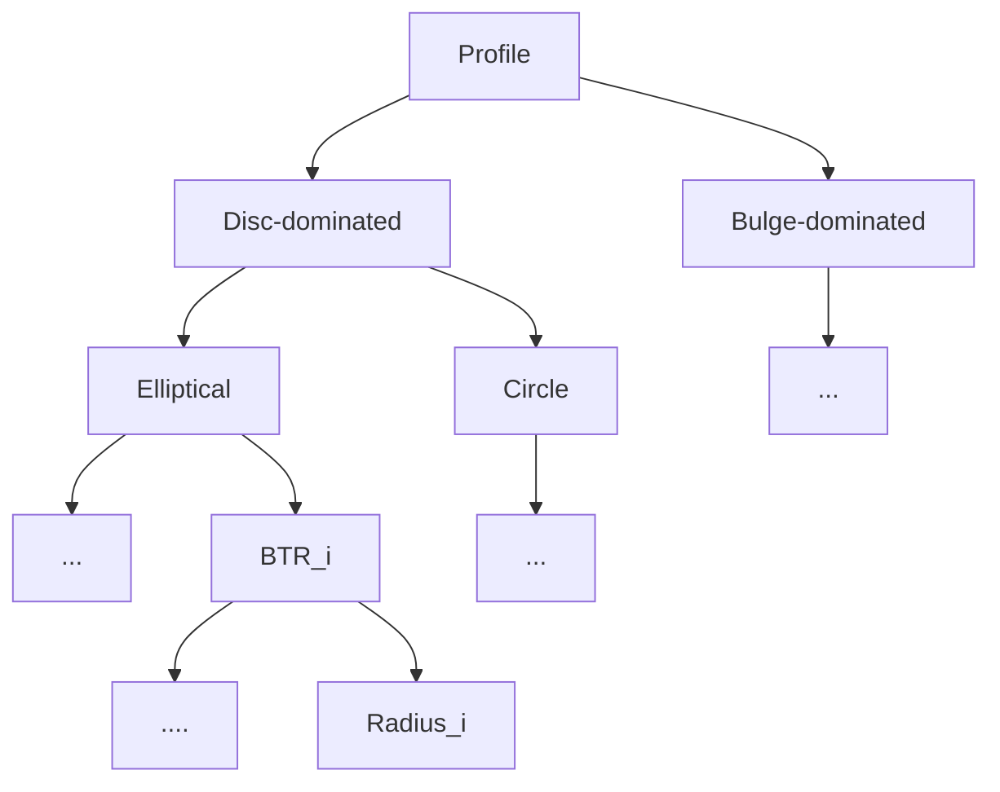

Change rate V.S. shear

Profile: Disc-dominated & Bulge-dominated

Ellipticity: 0, 0.3, 0.5, 0.8

BTR: 0, 0.2, 0.4, 0.6, 0.8, 1.0

Radius (arcsec): 0.2, 0.4, 0.6, 0.8, 1.0

SEX filter: gauss2.0, gauss3.0, gauss4.0

Threshold: 1.5$\sigma$, 2$\sigma$ 

