

# 
**Selection bias note**

## 
Simulation setup

**Pixel scale**: 0.187 arcsec (CFHTLenS)

**PSF**: Moffat, FWHM=0.7 arcsec, the typical value in CFHTLenS

**Galaxy**: disc-dominated & bulge-dominated (9:1), random walk

**Radius**:

 $$log_e(r_d) = -1.145 - 0.269(i_{814} - 23), \quad  P(r) \propto  r \exp [-(r/a)^\alpha], \quad a= r_d /0.833, \alpha=4/3$$

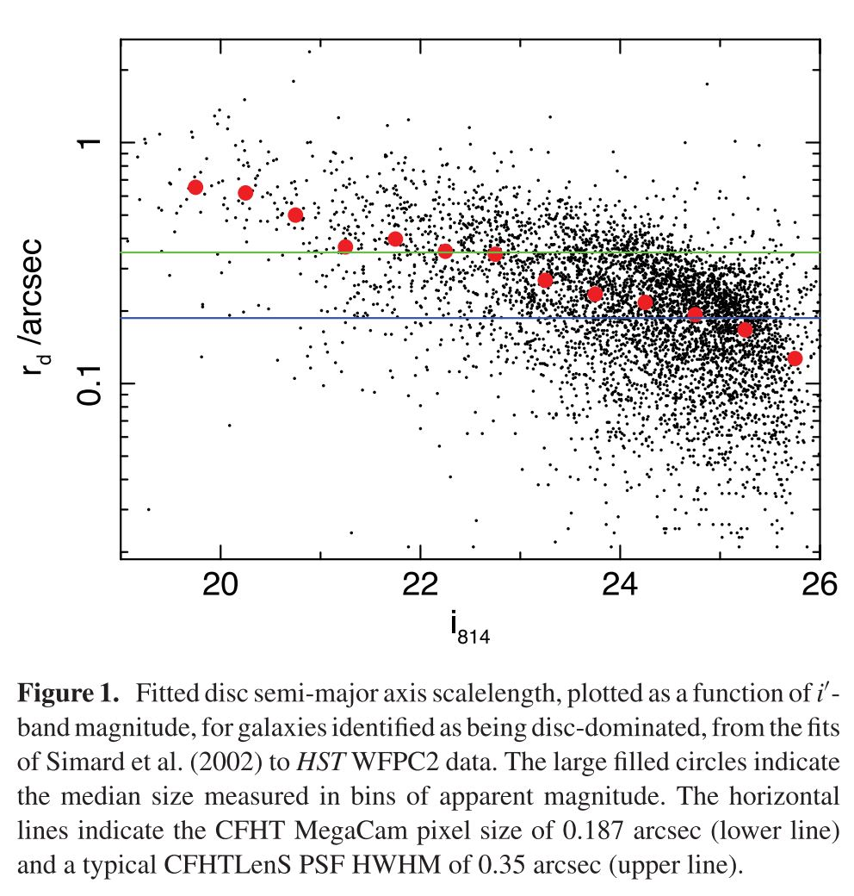

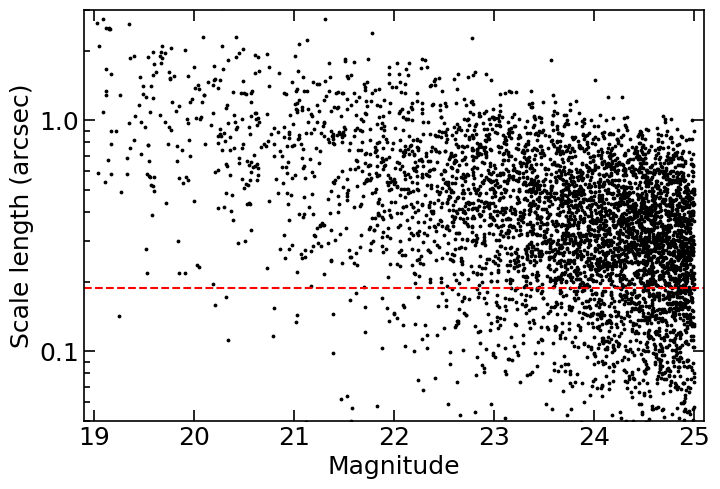 

**PDF of ellipticity**

a. disc: 

$$P(e) = {A e[1- \exp{ (\frac{e-e_{max}}{a}})]}/ [(1+e)(e^2 + e_0^2)^{1/2}], \quad  e_{max}=0.804, e_0 = 0.0256, a = 0.2539$$

b. bulge: 

$$P(e) \propto e \exp{[-be - ce^2]}, \quad b = 2.368, c=6.691$$

**Bulge-to-total ratio**: 

$$ f(ratio) = \exp{[-\frac{{ratio}^2}{2\sigma ^2}]}, \quad \sigma=0.1$$

**Random walk**:

a. CPP: 45 points, max radius = 8

b. galsim: 200 points, half_light_radius and flux are the same as galsim galaxy sample 

***

## 
Selection bias

**Origin**: the selection function correlates with the shear signal

**Truncation due to finite stamp size**

noise free,\\(48 \times 48\\),\\(64 \times 64\\),\\(96 \times 96\\) magnitude: 20, scale raidus(arcsec): 1.0(left) \\( \sim \\) 0.5(right), btr=0 (the most extensive profile)

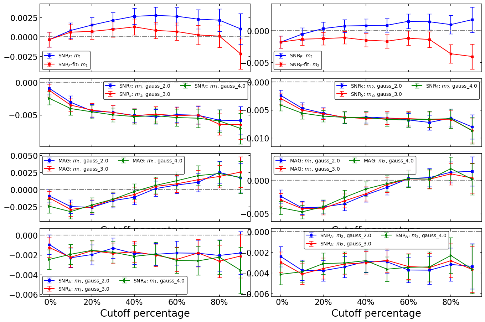
<!--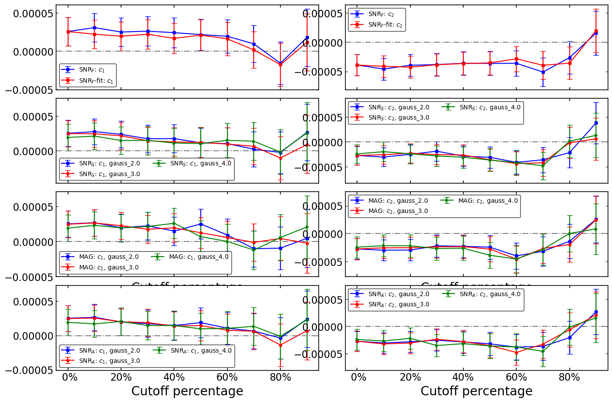-->
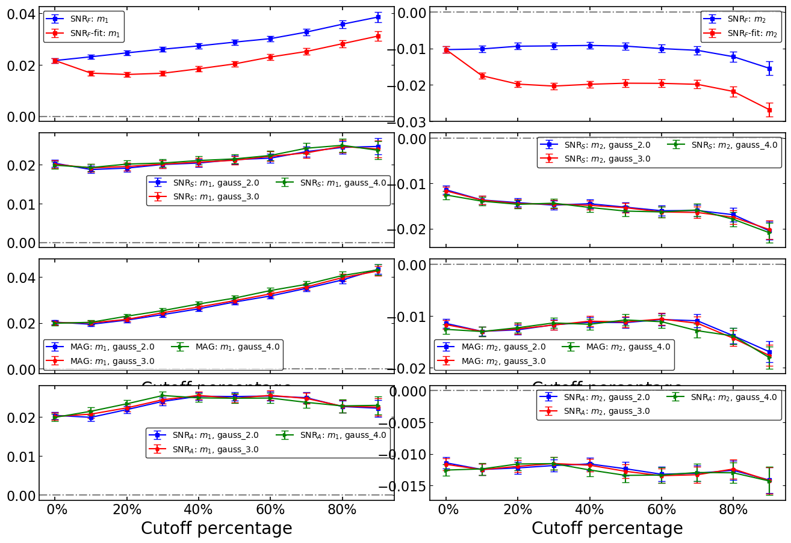
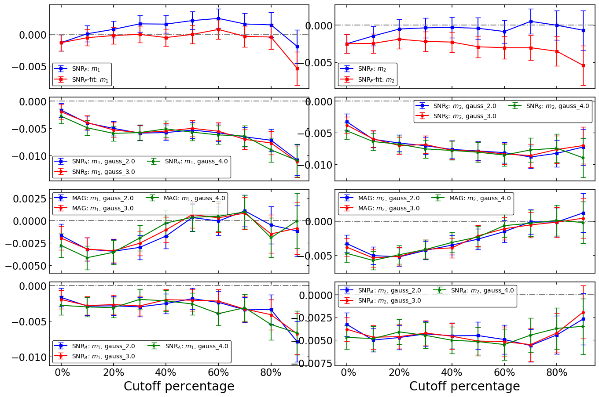

Upper: 10 million galaxies, \\(48 \times 48\\), Scale radius 0.2 \\( \sim \\) 0.9.
Middle: 10 million galaxies, \\(32 \times 32\\), Scale radius 0.2 \\( \sim \\) 0.9
Lower: 5 million galaxies, \\(48, \times 48 \\), Scale radius 0.2 \\( \sim \\) 0.9

The brighter, the larger. So as the cutoff threshold increasing, the effects of truncation will be more obvious and will give rise to multiplicative bias. However, it seems that the fitting \\( SNR_F\\) will correct it. But the correction will be useless when the stamp becomes smaller. The middle panel show a obvious multiplicative bias.

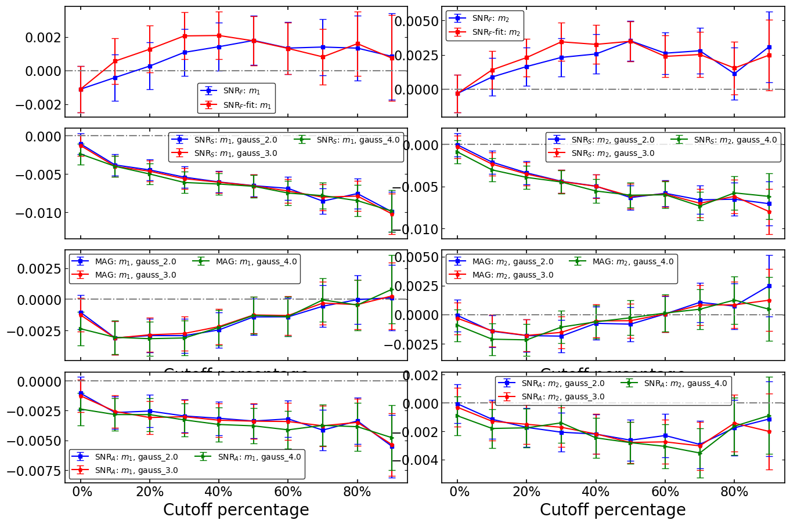

5 million galaxies, \\( 96 \times 96 \\), Scale radius \\(0.3 \sim 1.0 \\), mag: \\(20 \sim 24.8 \\)

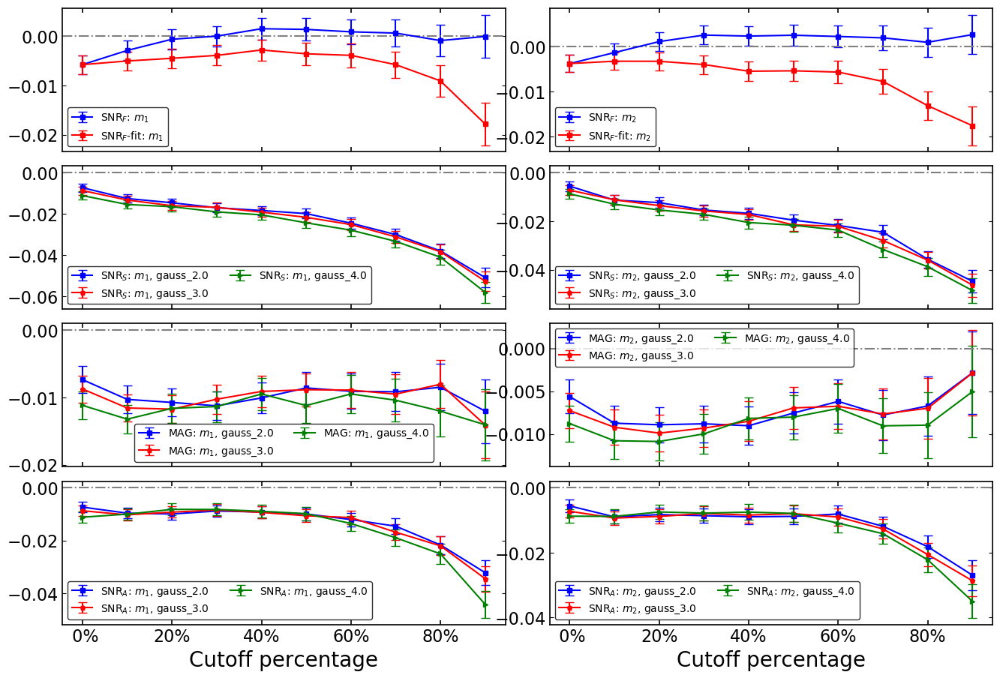

3 million, \\(48 \times 48 \\), scale radius \\( 0.3 \sim 0.8 \\), mag: \\( 23 \sim 24.8\\)

## 
 smooth
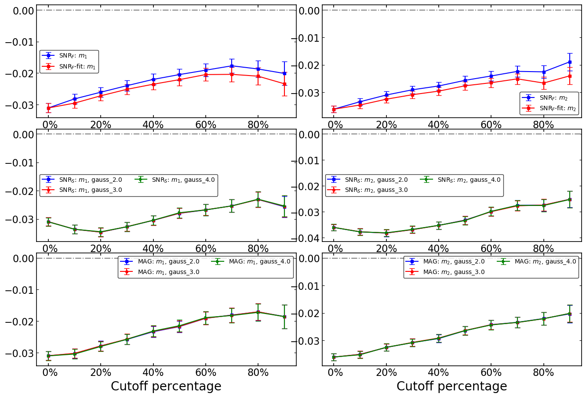
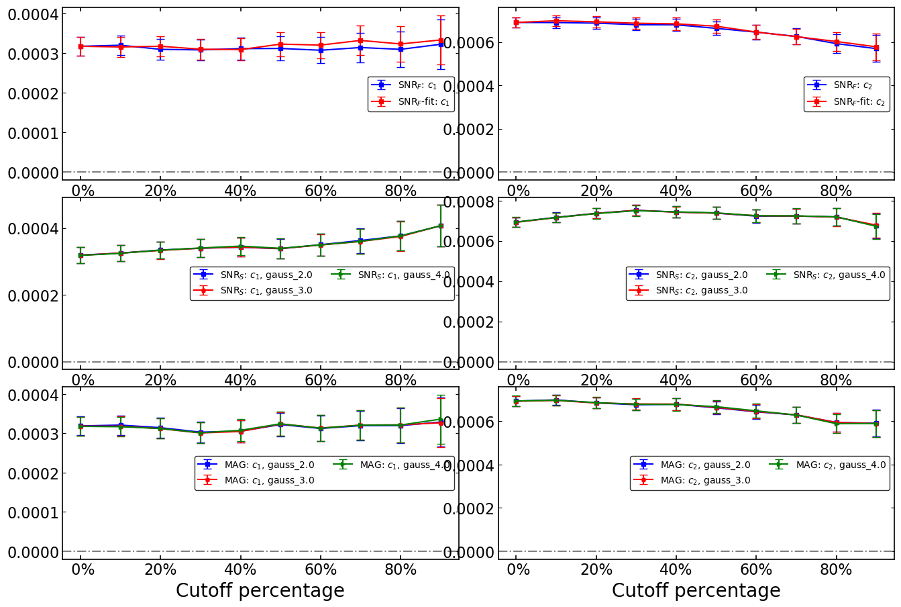

Results of 3 million smoothed galaxies (and PSF), \\(48 \times 48 \\), with the same properties as CFHTLenS.
The results of smoothed galaxies (non-smoothed PSF) are almost the same.

## 
 $$SNR_F$$
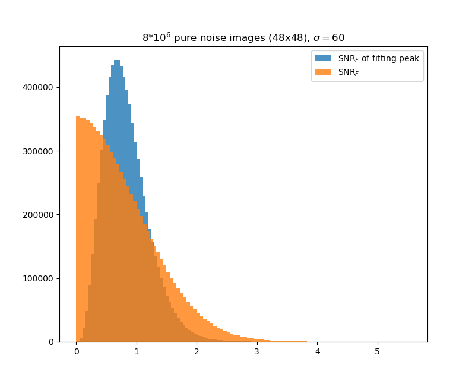

The \\(SNR_F\\)'s，orange histogram, are measured from \\( 8 \times 10^6\\) pure noise images (\\(48 \times 48\\)). The blue histogram shows the PDF of \\(SNR_F\\) measured from fitting peaks. The non-fitting \\(SNR_F\\)'s peak at \\(\sim\\) 0 which means no source detection. That confirms to our intuitives. However, as the definition shows, the \\(SNR_F\\) of pure source should be 1 as what the histogram shows. The fitting algorithm constrains the PDF and makes it peaks at 1. As we see, using the fitting one as selection criterion will give rise to selection bias.