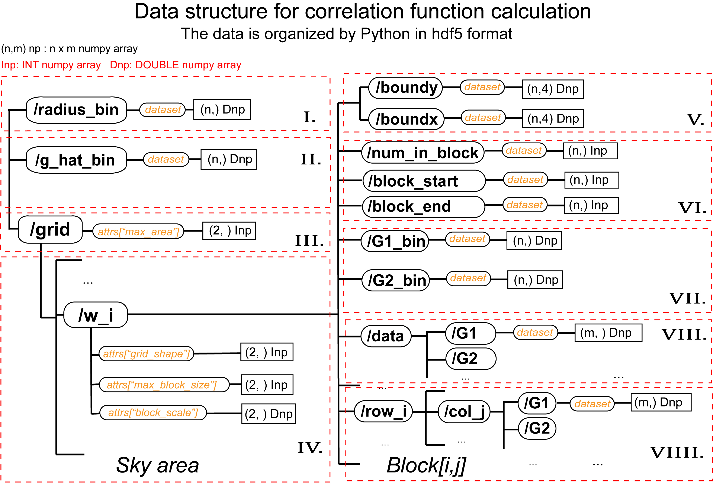

The shear eastimator: \\(G_1\\), \\(G_2\\), \\(N\\), \\(U\\), \\(V\\).

Spin-0:

$$ N \rightarrow N$$

Spin-2:

$$\begin{aligned} G_1^{\prime}+iG_2^{\prime} &= (G_1+iG_2)\exp(2i\theta) \\\\
   G_1^{\prime} &= G_1\cos(2\theta)  - G_2\sin(2\theta) \\\\
   G_2^{\prime} &= G_1\sin(2\theta)  + G_2\cos(2\theta) \end{aligned}$$

Spin-4:

$$\begin{aligned} U^{\prime}+iV^{\prime} &= (U+iV)\exp(4i\theta) \\\\
   U^{\prime} &= U\cos(4\theta)  - V\sin(4\theta) \\\\
   V^{\prime} &= U\sin(4\theta)  + V\cos(4\theta) \end{aligned}$$

Two points: (\\(\alpha_1, \beta_1\\)), (\\(\alpha_2, \beta_2\\)).

$$\Gamma :=(\alpha_2 - \alpha_1)/(\beta_2 - \beta_1)$$
<table border="0">
 <tr>
    <td>$$\begin{aligned}\cos (\theta) &= \frac{\alpha_2 - \alpha_1}{\sqrt{(\alpha_2 - \alpha_1)^2 + (\beta_2 - \beta_1)^2}} \\\\ &=\frac{(\alpha_2 - \alpha_1)/(\beta_2 - \beta_1)}{\sqrt{[(\alpha_2 - \alpha_1)/(\beta_2 - \beta_1)]^2 +1}}  \\\\ &= \frac{\Gamma}{\sqrt{\Gamma^2+1}} \end{aligned}$$ </td>
    <td>$$\begin{aligned} \sin (\theta) &= \frac{\beta_2 - \beta_1}{\sqrt{(\alpha_2 - \alpha_1)^2 + (\beta_2 - \beta_1)^2}} \\\\&=\frac{1}{\sqrt{[(\alpha_2 - \alpha_1)/(\beta_2 - \beta_1)]^2 +1}} \\\\ &= \frac{1}{\sqrt{\Gamma^2+1}} \end{aligned}$$</td>
 </tr>
</table>

<table border="0">
 <tr>
    <td>$$\begin{aligned} \cos(2\theta) &= \cos^2(\theta) - \sin^2(\theta) \\\\ &= \frac{(\alpha_2 - \alpha_1)^2 - (\beta_2 - \beta_1)^2}{(\alpha_2 - \alpha_1)^2 + (\beta_2 - \beta_1)^2} \\\\ &= \frac{\Gamma^2-1}{\Gamma^2+1} \end{aligned}$$</td>
    <td>$$\begin{aligned} \sin(2\theta)  &= 2\cos(\theta)\sin(\theta) \\\\ &= \frac{2(\alpha_2 - \alpha_1)(\beta_2 - \beta_1)}{(\alpha_2 - \alpha_1)^2 + (\beta_2 - \beta_1)^2} \\\\ &= \frac{2\Gamma}{\Gamma^2+1} \end{aligned}$$</td>
 </tr>
</table>

$$\begin{aligned} \cos(4\theta)  &= \cos^2(2\theta) - \sin^2(2\theta)  \\\\&= \frac{[(\alpha_2 - \alpha_1)^2 - (\beta_2 - \beta_1)^2]^2 - 4(\alpha_2 - \alpha_1)^2(\beta_2 - \beta_1)^2} {[(\alpha_2 - \alpha_1)^2 + (\beta_2 - \beta_1)^2]^2} \\\\ &= \frac{(\Gamma^2-1)^2 - 4\Gamma^2}{(\Gamma^2+1)^2} \end{aligned}$$

$$\begin{aligned} \sin(4\theta)  &= 2\cos(2\theta)\sin(2\theta)  \\\\&= \frac{4[(\alpha_2 - \alpha_1)^2 - (\beta_2 - \beta_1)^2](\alpha_2 - \alpha_1)(\beta_2 - \beta_1)}{[(\alpha_2 - \alpha_1)^2 + (\beta_2 - \beta_1)^2]^2} \\\\ &= \frac{4\Gamma (\Gamma^2-1)}{(\Gamma^2+1)^2} \end{aligned}$$

 