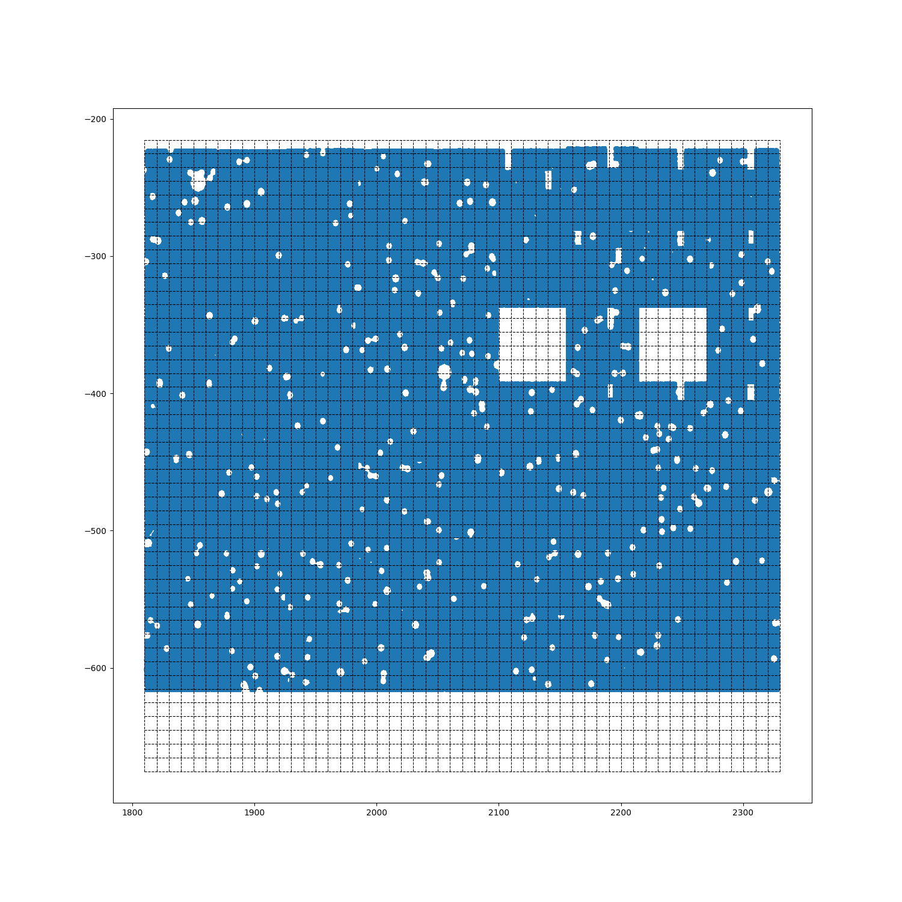
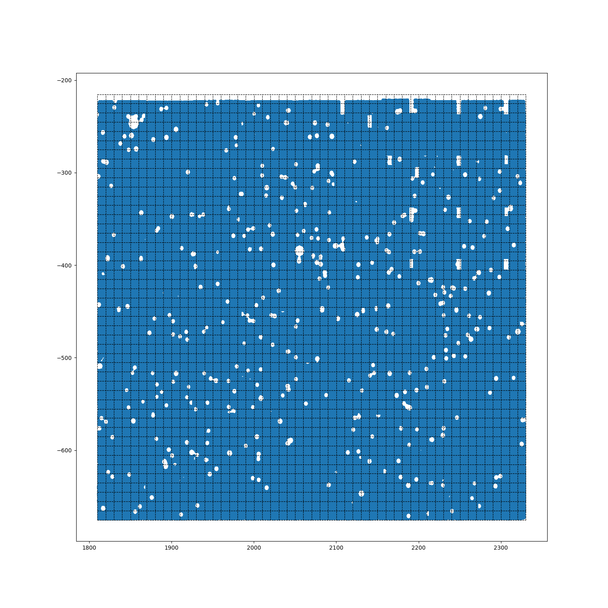
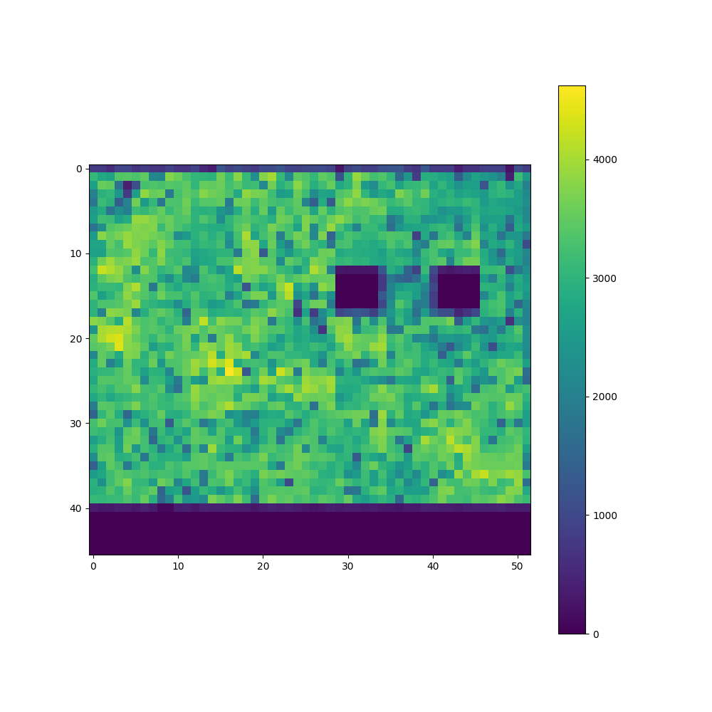
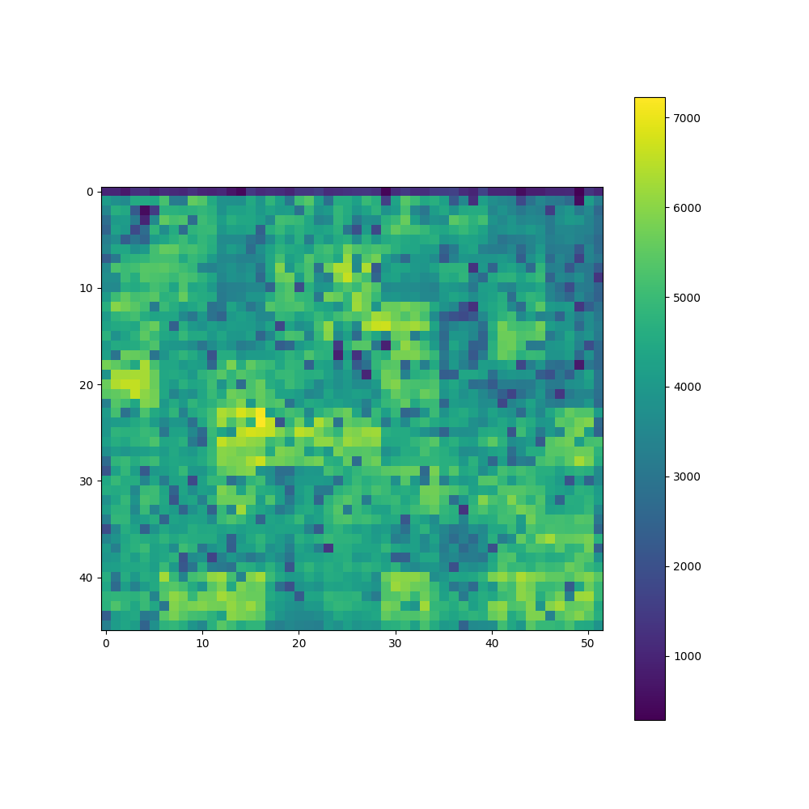

The abnormal value of magnitude in CFHT: -99, 98, 99.

The number of galaxy has magnitude measurment is smaller than that has redshift measurement.

The redshift: 0.01 ~ 7.0. (0.2 ~ 1.3 are well measured)

 

Left: only the reasonable magnitude measurement. Right: all the source

 

Left: only the reasonable magnitude measurement. Right: all the source