

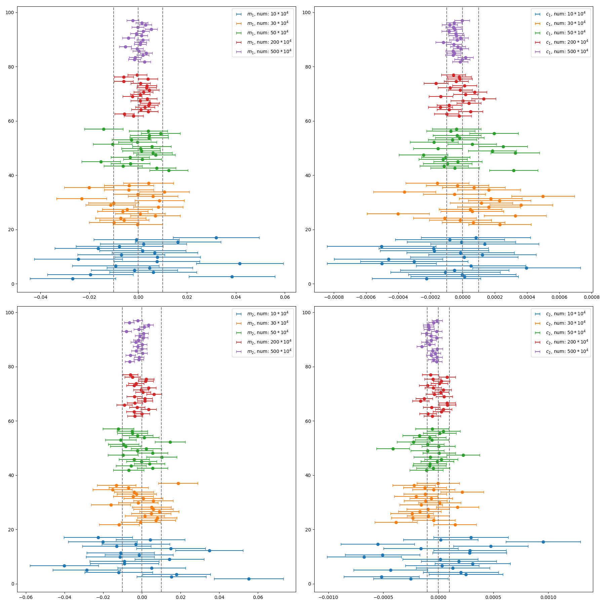
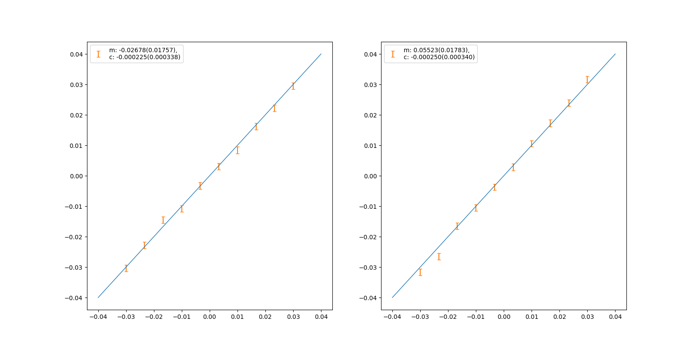
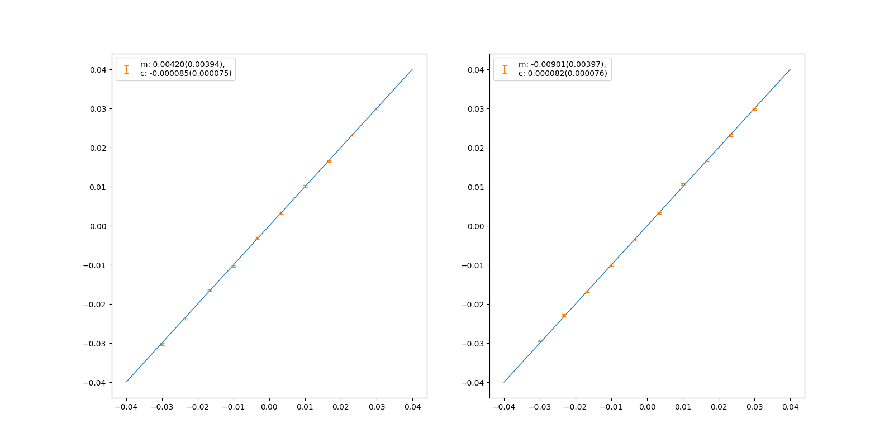

Mag: 20 \\(\sim \\) 26.5, 15 million galaxies, \\(48 \times 48 \\).
Results from all images (nothing has been discarded) with 10 bootstraps.

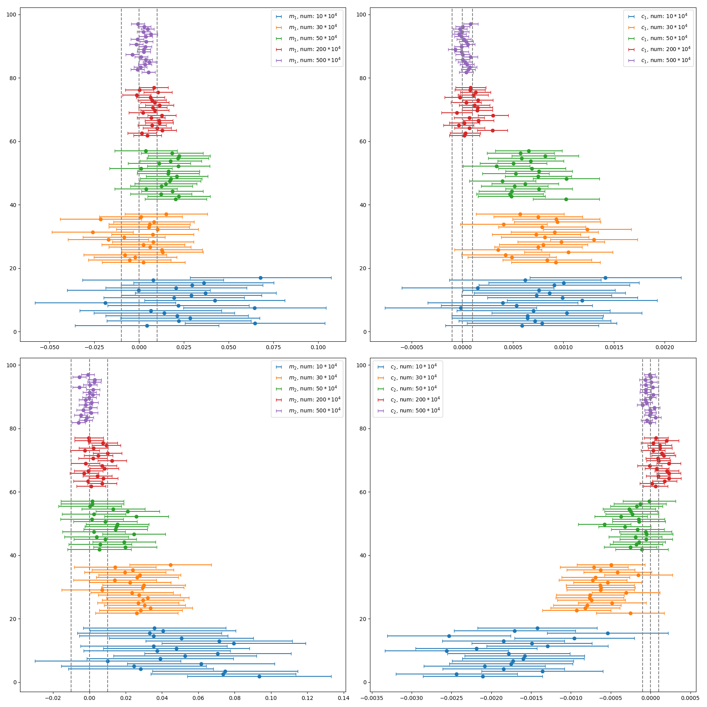
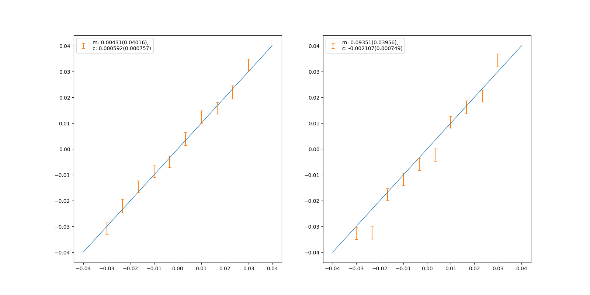
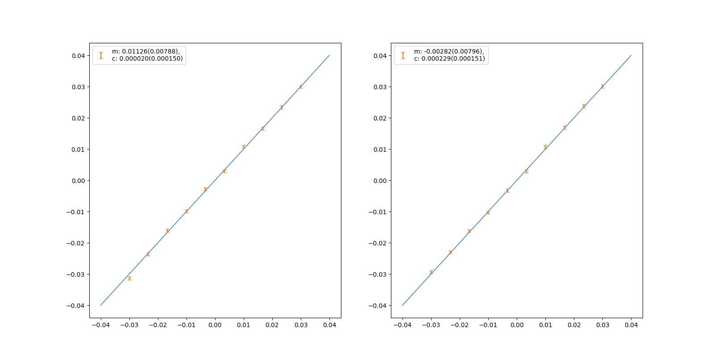

Mag: 20 \\(\sim \\) 26.5, 15 million galaxies, \\(48 \times 48 \\).
Results from all images (nothing has been discarded) with 5 times pure noise images by bootstraps. There are totally 8 million pure noise images.

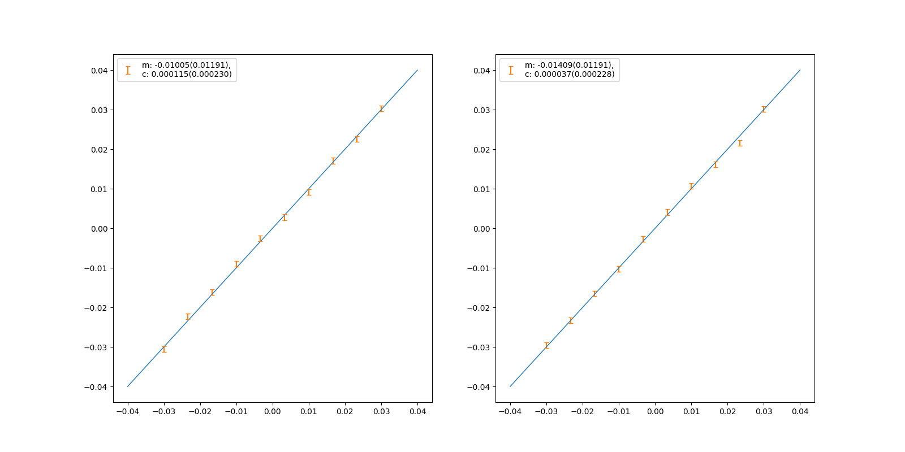
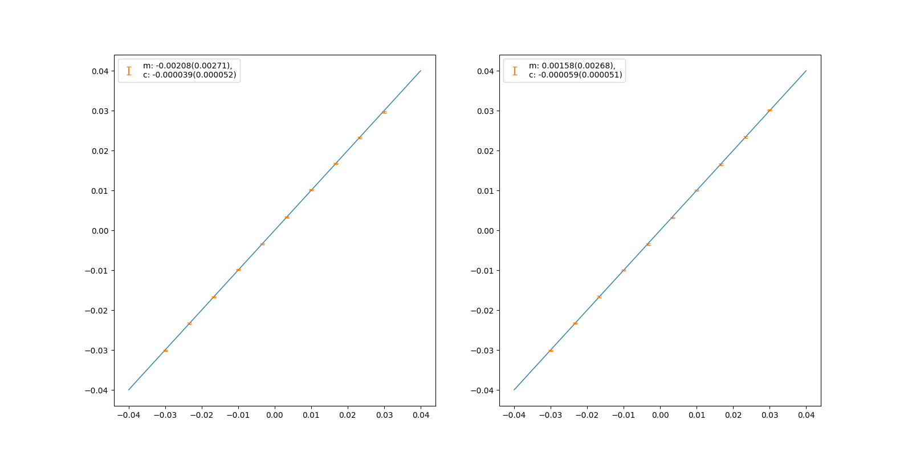

Mag: 20 \\(\sim \\) 26.5, 15 million galaxies, \\(48 \times 48 \\).
Results from detected images (aoubt 8 million) by bootstraps. There are totally 8 million pure noise images.

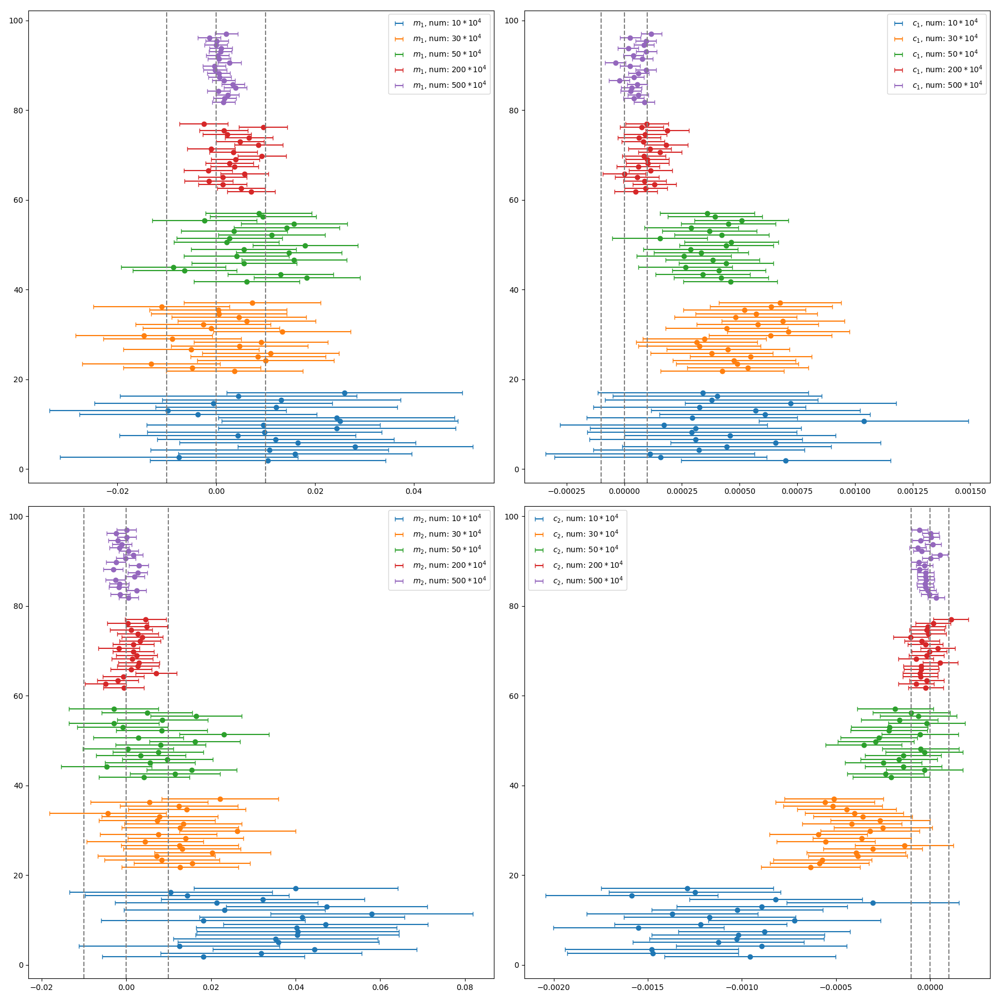
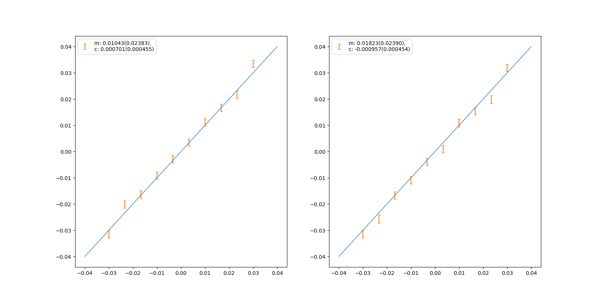
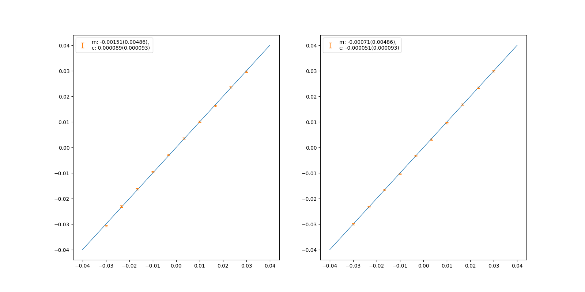

Mag: 20 \\(\sim \\) 26.5, 15 million galaxies, \\(48 \times 48 \\).
Results from detected images with 5 times pure noise images by bootstraps. There are totally 8 million pure noise images.